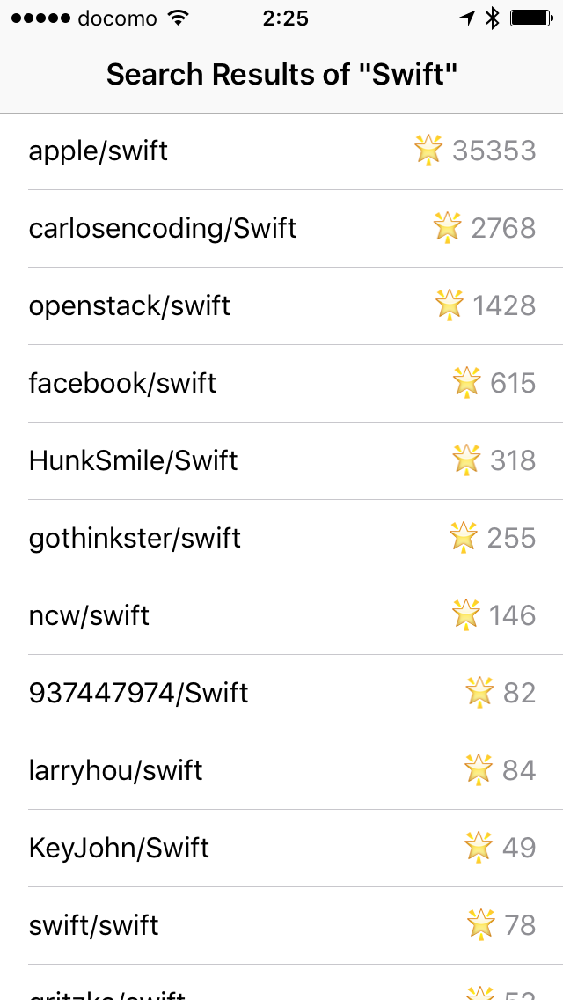

# RxPagination

This is the demo project for my presentation at try! Swift conference 2016.

- Slides: https://speakerdeck.com/ishkawa/protocol-oriented-programming-in-networking
- Video: https://news.realm.io/news/tryswift-yosuke-ishikawa-protocol-oriented-networking/

## Set Up

- `carthage bootstrap --platform iOS`

  使用carthage有问题，已经更改为pod install

## Requirements

- Swift 3.0.1
- Xcode 8.1

## Summary

This demo project illustrates how to use RxSwift, Action and APIKit. The demo app fetches repositories via GitHub search API and displays them using the libraries.



### ViewModel

`PaginationViewModel<Element>` is a view model for pagination. It has an initializer with type parameter `Request`, which is constrained to conform to `PaginationRequest` protocol. When `PaginationViewModel<Element>` is instantiated via `init<Request>(baseRequest:)`, the type of its property that represents pagination elements will be inferred as `Observable<[Request.Response.Element]>`.

```swift
class PaginationViewModel<Element: Decodable> {
    let indicatorViewAnimating: Driver<Bool>
    let elements: Driver<[Element]>
    let loadError: Driver<Error>

    init<Request: PaginationRequest>(
        baseRequest: Request,
        viewWillAppear: Driver<Void>,
        scrollViewDidReachBottom: Driver<Void>) where Request.Response.Element == Element {...}
}
```

### ViewController

Once ViewModel is instantiated with a `Request` type parameter, remained task that ViewController have to do is binding input streams and output streams.


```swift
class SearchRepositoriesViewController: UITableViewController {
    @IBOutlet weak var indicatorView: UIActivityIndicatorView!

    private let disposeBag = DisposeBag()
    private var viewModel: PaginationViewModel<Repository>!

    override func viewDidLoad() {
        super.viewDidLoad()

        let baseRequest = GitHubAPI.SearchRepositoriesRequest(query: "Swift")

        viewModel = PaginationViewModel(
            baseRequest: baseRequest,
            viewWillAppear: rx.viewWillAppear.asDriver(),
            scrollViewDidReachBottom: tableView.rx.reachedBottom.asDriver())

        disposeBag.insert([
            viewModel.indicatorViewAnimating.drive(indicatorView.rx.isAnimating),
            viewModel.elements.drive(tableView.rx.items(cellIdentifier: "Cell", cellType: RepositoryCell.self)),
            viewModel.loadError.drive(onNext: { print($0) }),
        ])
    }
}
```

## Contact

Twitter: https://twitter.com/_ishkawa
